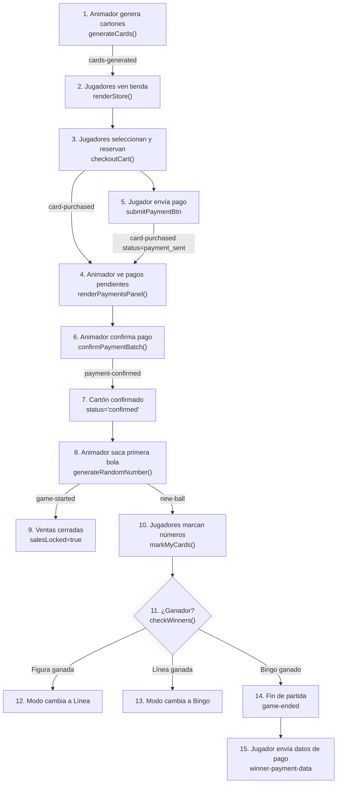

# 📋 Bingo Pro Max — Documentación Completa del Proyecto

## Índice

1. [Arquitectura General](#arquitectura-general)
2. [Estructura de Archivos](#estructura-de-archivos)
3. [Base de Datos (Supabase)](#base-de-datos-supabase)
4. [Variables Globales](#variables-globales)
5. [Comunicación en Tiempo Real (Broadcast Events)](#comunicación-en-tiempo-real)
6. [Flujo del Juego Completo](#flujo-del-juego-completo)
7. [Funciones del Animador (script_v4.js)](#funciones-del-animador)
8. [Funciones del Jugador (player.js)](#funciones-del-jugador)
9. [Operaciones con la Base de Datos](#operaciones-con-la-base-de-datos)
10. [Sistema de Premios](#sistema-de-premios)
11. [Sistema de Autenticación](#sistema-de-autenticación)
12. [Dependencias Externas](#dependencias-externas)

---

## Arquitectura General

El proyecto es un **juego de Bingo multijugador en tiempo real** con dos interfaces:

- **Animador** (`index.html` + `script_v4.js`): Controla la partida. Genera cartones, saca bolas, confirma pagos, verifica ganadores.
- **Jugador** (`player.html` + `player.js`): Se registra, compra cartones, paga, marca números, canta premios.

**No hay servidor backend (Node.js).** Toda la lógica es **client-side** y la comunicación se realiza a través de:

- **Supabase Database** → Persistencia de datos (cartones, pagos, ganadores, estado del juego).
- **Supabase Realtime Broadcast** → Comunicación P2P en tiempo real entre animador y jugadores, en un canal llamado `bingo-room`.

```
┌──────────────────┐     Supabase Broadcast     ┌──────────────────┐
│                  │◄──────── bingo-room ───────►│                  │
│  ANIMADOR        │                             │  JUGADOR(ES)     │
│  script_v4.js    │     Supabase Database       │  player.js       │
│  index.html      │◄─── bingo_cards, etc. ─────►│  player.html     │
│  styles.css      │                             │  player.css      │
└──────────────────┘                             └──────────────────┘
```

---

## Estructura de Archivos

```
bingo-gameVercelsupabase/
├── src/
│   ├── index.html          # HTML del Animador (interfaz principal)
│   ├── script_v4.js        # Lógica JavaScript del Animador (~1832 líneas)
│   ├── styles.css           # CSS del Animador
│   ├── player.html          # HTML del Jugador
│   ├── player.js            # Lógica JavaScript del Jugador (~1918 líneas)
│   ├── player.css           # CSS del Jugador
│   ├── spin-sound.mp3       # Sonido de animación al sacar bola
│   └── winner-sound.mp3     # Sonido al detectar ganador
├── supabase-schema.sql      # Esquema completo de la BD
├── vercel.json              # Config para deploy en Vercel
├── package.json             # Dependencias npm
└── README.md
```

---

## Base de Datos (Supabase)

### Conexión

Ambos archivos (`script_v4.js` y `player.js`) se conectan al **mismo proyecto Supabase** usando la API key pública (`anon`):

```javascript
const supabaseUrl = 'https://rhzgfxbunkbqqkgiregs.supabase.co';
const supabaseKey = 'eyJhbGciOiJIUzI1NiIs...';
const supabaseClient = window.supabase.createClient(supabaseUrl, supabaseKey);
const bingoChannel = supabaseClient.channel('bingo-room');
```

### Tablas

#### 1. `bingo_users` — Jugadores registrados

| Columna        | Tipo   | Descripción                          |
|---------------|--------|--------------------------------------|
| `username`     | text PK | Nombre de usuario (identificador)   |
| `password`     | text    | Contraseña (texto plano)            |
| `display_name` | text    | Nombre para mostrar en UI           |
| `role`         | text    | `'player'` o `'admin'`              |

#### 2. `bingo_game_state` — Estado del juego (Singleton, id=1)

| Columna | Tipo   | Descripción                                     |
|---------|--------|-------------------------------------------------|
| `id`     | int PK | Siempre `1` (CHECK constraint)                  |
| `state`  | jsonb  | Objeto JSON con todo el estado: `calledNumbers`, `gameMode`, `gameStarted`, `currentGameId`, `ballCount`, etc. |

#### 3. `bingo_cards` — Cartones de bingo

| Columna      | Tipo    | Descripción                                    |
|-------------|---------|------------------------------------------------|
| `serial`     | text PK | Serial único del cartón                        |
| `numbers`    | jsonb   | Los números: `{B:[...], I:[...], N:[...], G:[...], O:[...]}` |
| `status`     | text    | `'available'`, `'reserved'`, `'payment_sent'`, `'confirmed'` |
| `buyer_name` | text FK | Username del comprador (→ `bingo_users`)       |
| `price`      | numeric | Precio del cartón                              |

#### 4. `bingo_payments` — Pagos realizados

| Columna            | Tipo    | Descripción                               |
|-------------------|---------|-------------------------------------------|
| `id`               | uuid PK | ID único auto-generado                    |
| `buyer_name`       | text FK | Username del comprador (→ `bingo_users`)  |
| `payment_method`   | text    | Método de pago (ej: "Transferencia")      |
| `reference_number` | text    | Referencia del pago                       |
| `amount`           | numeric | Monto total                               |
| `status`           | text    | `'pending'`, `'approved'`, `'rejected'`   |
| `cards`            | jsonb   | Array de seriales: `["1","2","3"]`        |
| `created_at`       | timestamp | Fecha de creación                       |

#### 5. `bingo_winners` — Ganadores registrados

| Columna              | Tipo    | Descripción                           |
|---------------------|---------|---------------------------------------|
| `id`                 | uuid PK | ID único auto-generado               |
| `card_index`         | text    | Serial del cartón ganador            |
| `prize_type`         | text    | `'Bingo'`, `'Línea'`, `'Figura X'`, etc. |
| `player_name`        | text    | Nombre del jugador ganador           |
| `game_id`            | text    | ID de la partida                     |
| `payment_status`     | text    | `'pending'` o `'paid'`              |
| `winner_payment_data`| jsonb   | Datos de pago del ganador (nombre, cédula, banco, teléfono) |
| `created_at`         | timestamp | Fecha                              |

#### 6. `bingo_payment_config` — Configuración de métodos de pago (Singleton, id=1)

| Columna   | Tipo   | Descripción                                                  |
|-----------|--------|--------------------------------------------------------------|
| `id`       | int PK | Siempre `1`                                                  |
| `methods`  | jsonb  | Array de métodos: `[{type:"pago_movil", telefono:"...", cedula:"..."}, ...]` |

### Seguridad (RLS)

Todas las tablas tienen **Row Level Security habilitado** con políticas permisivas (`USING (true) WITH CHECK (true)`), permitiendo lectura/escritura pública. Esto es para facilitar la migración rápida P2P.

---

## Variables Globales

### Animador (`script_v4.js`)

| Variable | Tipo | Valor inicial | Descripción |
|----------|------|---------------|-------------|
| `calledNumbers` | `Set<number>` | `new Set()` | Números ya sacados |
| `totalBalls` | `const number` | `75` | Total de bolas |
| `currentNumber` | `number\|null` | `null` | Último número sacado |
| `isAnimating` | `boolean` | `false` | Si está animando una bola |
| `gameMode` | `string` | `'figure'` | Modo actual: `'figure'`, `'line'`, `'bingo'` |
| `winners` | `Set<string>` | `new Set()` | Set de ganadores detectados: `"serial-tipo"` |
| `lastBalls` | `number[]` | `[]` | Últimas 10 bolas sacadas |
| `ballCount` | `number` | `0` | Cantidad de bolas sacadas |
| `totalPrize` | `number` | `0` | Pote total de premios |
| `selectedFigure` | `string` | `'X'` | Figura seleccionada: `'X'`, `'L'`, `'N'`, `'T'`, `'H'` |
| `cardsGenerated` | `boolean` | `false` | Si ya se generaron cartones |
| `nextCardSerial` | `number` | `1` | Próximo serial disponible |
| `cardPrice` | `number` | `10` | Precio por cartón |
| `currentGameId` | `string` | `''` | ID único de la partida actual |
| `allTimeWinnersCache` | `array` | `[]` | Cache de ganadores de todas las partidas (cargado de BD) |
| `gameStarted` | `boolean` | `false` | Si la partida ya comenzó (se sacó la primera bola) |
| `pendingPayments` | `object` | `{}` | Pagos pendientes: `{ serial: { buyer, buyerDbName, status, paymentData, reservedAt } }` |

### Jugador (`player.js`)

| Variable | Tipo | Valor inicial | Descripción |
|----------|------|---------------|-------------|
| `playerName` | `string` | `''` | `username` del jugador (clave en BD) |
| `playerDisplayName` | `string` | `''` | Nombre visual |
| `calledNumbers` | `Set<number>` | `new Set()` | Copia local de los números sacados |
| `myCards` | `Set<string>` | `new Set()` | Seriales de cartones del jugador |
| `myCardStatuses` | `object` | `{}` | `{ serial: 'reserved'\|'payment_sent'\|'confirmed' }` |
| `allCards` | `array` | `[]` | Lista de TODOS los cartones de la partida |
| `cardPrice` | `number` | `0` | Precio por cartón |
| `selectedCards` | `Set<string>` | `new Set()` | Cartones seleccionados para compra |
| `activePaymentSerials` | `string[]` | `[]` | Seriales actualmente en el modal de pago |
| `salesLocked` | `boolean` | `false` | Si las ventas están cerradas (partida en curso) |
| `markingMode` | `string` | `'auto'` | `'manual'` o `'auto'` |
| `currentGameMode` | `string` | `'figure'` | Modo de juego recibido del animador |
| `animatorPaymentConfig` | `object\|array` | `{...}` | Config de pago del animador |
| `manualMarks` | `object` | `{}` | `{ serial: Set<value> }` para marcas manuales |
| `totalPrize` | `number` | `0` | Pote total |
| `gamePaused` | `boolean` | `false` | Juego pausado por verificación de canto |
| `currentGameId` | `string` | `''` | ID de la partida |
| `currentSelectedFigure` | `string` | `'X'` | Figura seleccionada |

---

## Comunicación en Tiempo Real

Toda la comunicación usa **Supabase Broadcast** en el canal `bingo-room`. Los eventos viajan entre el animador y los jugadores:

### 📤 Eventos emitidos por el Animador → Jugadores

| Evento | Payload | Cuándo se emite |
|--------|---------|-----------------|
| `cards-generated` | `{ cards, cardPrice, gameMode, selectedFigure, gameId }` | Al generar nuevos cartones |
| `game-started` | `{ cards, totalPrize, gameMode, selectedFigure, gameId, removedCount }` | Al sacar la primera bola (game started) |
| `new-ball` | `{ number, calledNumbers, lastBalls, ballCount }` | Cada vez que se saca una bola |
| `winner-announced` | `{ cardIndex, prizeType, nextMode, gameId }` | Cuando se confirma un ganador |
| `game-ended` | `{ gameId, totalPrize, winners[] }` | Cuando se gana el Bingo (fin de partida) |
| `game-paused` | `{ playerName, cardSerial, claimType }` | Cuando un jugador canta y se verifica |
| `claim-result` | `{ valid, playerName, claimType, cardSerial }` | Resultado de la verificación del canto |
| `game-reset` | `{}` | Al iniciar nueva partida |
| `game-break` | `{ minutes }` | Al declarar receso |
| `payment-confirmed` | `{ serial, status, buyerDbName }` | Cuando el animador confirma un pago |
| `payment-config-updated` | `[{type, telefono, cedula}, ...]` | Cuando el animador actualiza config de pago |
| `sync-state` | `{ calledNumbers, cards, cardPrice, currentNumber, lastBalls, ballCount, gameMode, selectedFigure, gameId, totalPrize, gameStarted, paymentConfig }` | Respuesta a `request-sync` |

### 📤 Eventos emitidos por los Jugadores → Animador

| Evento | Payload | Cuándo se emite |
|--------|---------|-----------------|
| `card-purchased` | `{ serial, status, buyerDbName, buyerName, timestamp, paymentData? }` | Al reservar un cartón o enviar pago |
| `card-released` | `{ serial, buyer, buyerDbName, buyerName }` | Al cancelar una reserva |
| `player-claims-win` | `{ playerName, cardSerial, claimType }` | Cuando el jugador canta Línea/Figura/Bingo |
| `winner-payment-data` | `{ playerName, gameId, cardSerial?, prizeType?, paymentData }` | Datos de pago del ganador |
| `request-sync` | `{}` | Al conectarse, pide el estado actual al animador |

---

## Flujo del Juego Completo



### Detalle por Fase:

#### Fase 1: Preparación
1. El animador configura: precio, cantidad de cartones, figura, modo
2. `generateCards()` → crea cartones en memoria y en `bingo_cards`
3. Emite `cards-generated` → jugadores reciben catálogo

#### Fase 2: Venta
4. Jugadores seleccionan cartones → `toggleCardSelection()`
5. Al hacer checkout → `checkoutCart()` reserva en BD (`status='reserved'`)
6. Jugador llena datos de pago → inserta en `bingo_payments`
7. Animador ve pagos agrupados → `renderPaymentsPanel()`
8. Animador confirma → `confirmPaymentBatch()` actualiza `status='confirmed'`

#### Fase 3: Juego
9. Animador saca primera bola → `finalizeNumberGeneration()` emite `game-started`
10. Cartones no vendidos se eliminan, pote se recalcula
11. Cada bola → marca en todos los cartones, emite `new-ball`
12. `checkWinners()` verifica si algún cartón cumple la condición del modo actual

#### Fase 4: Ganador
13. Si hay ganador potencial → `askForWinner()` muestra modal de confirmación al animador
14. Si confirma → `updateWinnersLog()` guarda en `bingo_winners` y emite `winner-announced`
15. El modo avanza: `figure → line → bingo`
16. Al ganar Bingo → emite `game-ended` y muestra `showGameEndedModal()`

#### Fase 5: Pago de Premios
17. Jugador ganador recibe modal para ingresar datos de pago (`showWinnerPaymentDataModal()`)
18. Envía `winner-payment-data` → se guarda en `bingo_winners.winner_payment_data`
19. Animador puede ver datos y marcar como pagado en `submitWinnerPayment()`

---

## Funciones del Animador

### Inicialización y Estado

| Función | Descripción |
|---------|-------------|
| `getGameState()` | Serializa TODO el estado del juego en un objeto JSON (para autoguardado) |
| `autoSave()` | Guarda el estado en `localStorage` Y en `bingo_game_state` (Supabase) |
| `autoLoad()` | Carga estado de `localStorage` al iniciar (recovery mode) |
| `applyGameState(state)` | Aplica un objeto de estado al juego (restore/import) |
| `exportGame()` | Descarga el estado como archivo `.json` |

### Generación de Cartones

| Función | Descripción |
|---------|-------------|
| `generateCards()` | Crea N cartones, los inserta en BD, emite `cards-generated` |
| `generateBingoCard()` | Genera un cartón con números aleatorios usando `BingoNumberPool` |
| `createBingoCardElement(card, serial, price)` | Crea el elemento DOM visual del cartón |
| `BingoNumberPool` | Clase que garantiza distribución uniforme de números por columna |

### Mecánica del Juego

| Función | Descripción |
|---------|-------------|
| `generateRandomNumber()` | Inicia animación de la bola y llama a `finalizeNumberGeneration()` |
| `finalizeNumberGeneration(number)` | Marca la bola, emite `new-ball`, emite `game-started` (si primera bola), verifica ganadores |
| `markNumberInCards(number)` | Marca el número en todos los cartones del animador |
| `checkWinners()` | Verifica si algún cartón cumple la condición del modo actual |
| `askForWinner(message, cardElement)` | Modal de confirmación: ¿alguien cantó? |
| `updateWinnersLog(cardIndex, prizeType, markedNumbers)` | Actualiza log visual Y guarda en `bingo_winners` |

### Verificación de Patrones

| Función | Verifica |
|---------|----------|
| `checkFigure(card, figure)` | Si el cartón tiene la figura seleccionada |
| `checkLine(card)` | Si hay una fila o columna completa |
| `checkFullCard(card)` | Si todos los números están marcados (Bingo) |
| `checkX(cells)` | Patrón X: dos diagonales |
| `checkL(cells)` | Patrón L: columna izq + fila inferior |
| `checkN(cells)` | Patrón N |
| `checkT(cells)` | Patrón T: fila superior + columna central |
| `checkH(cells)` | Patrón H |

### Gestión de Pagos

| Función | Descripción |
|---------|-------------|
| `renderPaymentsPanel()` | Renderiza panel de pagos agrupados por comprador |
| `confirmPaymentBatch(buyerDbName)` | Confirma TODOS los cartones de un comprador |
| `rejectPaymentBatch(buyerDbName)` | Rechaza/libera TODOS los cartones de un comprador |
| `updateTotalPot()` | Recalcula el pote consultando cartones confirmados en BD |
| `assignBuyerNameToCard(serial, name)` | Asigna nombre del comprador al cartón en la vista del animador |

### Gestión de Partida

| Función | Descripción |
|---------|-------------|
| `executeNewGame()` | Reset completo: limpia BD, localStorage, emite `game-reset` |
| `showNewGameConfirm()` | Muestra modal de confirmación para nueva partida |
| `recalculatePrizes()` | Recalcula premios (Bingo 50%, Línea 20-30%, Figura 10%) |
| `showGameEndedModal(data)` | Muestra modal de fin de partida al animador |

---

## Funciones del Jugador

### Autenticación

| Función | Descripción |
|---------|-------------|
| `loginPlayer()` | Login con username/password contra `bingo_users` |
| `registerPlayer()` | Registro: valida y crea usuario en `bingo_users` |
| `enterGame(user)` | Punto de entrada común: guarda en localStorage, inicia broadcast |
| `autoLogin()` | Auto-login desde `localStorage` al cargar la página |

### Conexión y Sincronización

| Función | Descripción |
|---------|-------------|
| `initBroadcast()` | Suscribe al canal broadcast y registra TODOS los listeners de eventos |
| `setConnectionStatus(connected)` | Actualiza indicador visual de conexión |
| `loadInitialState()` | Carga estado inicial desde BD: cartones, estado del juego, config de pago |

### Tienda y Compra

| Función | Descripción |
|---------|-------------|
| `renderStore()` | Renderiza la tienda con todos los cartones (disponible/reservado/vendido) |
| `toggleCardSelection(serial)` | Selecciona/deselecciona un cartón para compra |
| `checkoutCart()` | Reserva todos los cartones seleccionados en BD, abre modal de pago |
| `updateCartBar()` | Actualiza la barra inferior del carrito |
| `updateStats()` | Actualiza estadísticas (mis cartones, disponibles, precio) |

### Pago

| Función | Descripción |
|---------|-------------|
| `openPaymentModal(serials, reservedAt)` | Abre modal de pago para N cartones |
| `openPaymentModalForReserved()` | Abre modal para cartones ya reservados |
| `closePaymentModal()` | Cierra modal de pago |
| `startPaymentTimer(reservedAt)` | Timer de 10 minutos para completar el pago |
| `updatePaymentConfigDisplay()` | Muestra datos de pago del animador (soporta array y objeto) |

### Marcado de Cartones

| Función | Descripción |
|---------|-------------|
| `renderMyCards()` | Renderiza los cartones confirmados del jugador con marcas |
| `markMyCards()` | Marca números en modo automático al recibir `new-ball` |
| `saveManualMarks()` | Guarda marcas manuales antes de re-render |
| `restoreManualMarks()` | Restaura marcas manuales después de re-render |
| `showModeSelectionModal()` | Modal para elegir modo manual vs auto (>3 cartones) |

### Cantar / Ganar

| Función | Descripción |
|---------|-------------|
| `updateSingButtons()` | Habilita/deshabilita botones de "cantar" según el modo |
| `claimWin(claimType)` | Envía `player-claims-win` al animador |
| `markCardAsWinner(serial, prizeType)` | Marca visualmente un cartón como ganador |
| `showPlayerGameEndedModal(data)` | Modal de fin de partida para el jugador (con form de datos de pago) |
| `showWinnerPaymentDataModal(cardSerial, prizeType, gameId)` | Modal inmediato para que el ganador ingrese datos de pago |
| `submitWinnerPaymentData()` | Envía datos de pago desde el modal de fin de partida |
| `submitWinnerPayDataModal(cardSerial, prizeType, gameId)` | Envía datos de pago desde el modal individual de ganador |

---

## Operaciones con la Base de Datos

### Lecturas (SELECT)

| Tabla | Dónde | Qué hace |
|-------|-------|----------|
| `bingo_users` | `player.js` → `loginPlayer()` | Verifica credenciales |
| `bingo_users` | `player.js` → `registerPlayer()` | Verifica si existe usuario |
| `bingo_users` | `script_v4.js` → carga de pagos | Obtiene `display_name` de compradores |
| `bingo_cards` | `player.js` → `loadInitialState()` | Carga cartones al entrar |
| `bingo_cards` | `script_v4.js` → `finalizeNumberGeneration()` | Obtiene cartones para `game-started` |
| `bingo_cards` | `script_v4.js` → `updateTotalPot()` | Cuenta cartones confirmados |
| `bingo_game_state` | `player.js` → `loadInitialState()` | Restaura estado del juego |
| `bingo_payment_config` | `player.js` → `loadInitialState()` | Carga config de pago |
| `bingo_payment_config` | `script_v4.js` → `request-sync` handler | Incluye config en sync |
| `bingo_payments` | `script_v4.js` → DOMContentLoaded | Carga pagos pendientes |
| `bingo_winners` | `script_v4.js` → DOMContentLoaded | Carga historial de ganadores al cache |

### Escrituras (INSERT)

| Tabla | Dónde | Qué hace |
|-------|-------|----------|
| `bingo_users` | `player.js` → `registerPlayer()` | Crea nuevo usuario |
| `bingo_cards` | `script_v4.js` → `generateCards()` | Inserta todos los cartones nuevos |
| `bingo_payments` | `player.js` → submit payment | Registra un pago |
| `bingo_winners` | `script_v4.js` → `updateWinnersLog()` | Registra un ganador |

### Actualizaciones (UPDATE)

| Tabla | Dónde | Qué hace |
|-------|-------|----------|
| `bingo_cards` | `player.js` → `checkoutCart()` | `status='reserved'`, `buyer_name=playerName` |
| `bingo_cards` | `player.js` → submit payment | `status='payment_sent'` |
| `bingo_cards` | `player.js` → cancel reservation | `status='available'`, `buyer_name=null` |
| `bingo_cards` | `script_v4.js` → `confirmPaymentBatch()` | `status='confirmed'` |
| `bingo_cards` | `script_v4.js` → `rejectPaymentBatch()` | `status='available'`, `buyer_name=null` |
| `bingo_game_state` | `script_v4.js` → `autoSave()` | Guarda estado completo |
| `bingo_game_state` | `script_v4.js` → `executeNewGame()` | Reset a `{}` |
| `bingo_payments` | `script_v4.js` → `confirmPaymentBatch()` | `status='approved'` |
| `bingo_payments` | `script_v4.js` → `rejectPaymentBatch()` | `status='rejected'` |
| `bingo_winners` | `script_v4.js` → `submitWinnerPayment()` | `payment_status='paid'` |
| `bingo_winners` | `script_v4.js` → `winner-payment-data` handler | Guarda `winner_payment_data` |
| `bingo_payment_config` | `script_v4.js` → save payment config | Guarda métodos de pago |

### Eliminaciones (DELETE)

| Tabla | Dónde | Qué hace |
|-------|-------|----------|
| `bingo_cards` | `script_v4.js` → `generateCards()` | Limpia cartones anteriores |
| `bingo_cards` | `script_v4.js` → `executeNewGame()` | Elimina todos |
| `bingo_cards` | `script_v4.js` → `finalizeNumberGeneration()` | Elimina no vendidos al iniciar juego |
| `bingo_payments` | `script_v4.js` → `executeNewGame()` | Elimina todos |

---

## Sistema de Premios

### Distribución (configurada en `recalculatePrizes()`)

**Con modo Figura activado:**
| Premio | Porcentaje |
|--------|------------|
| Bingo (cartón completo) | **50%** del pote |
| Línea (fila o columna) | **20%** del pote |
| Figura | **10%** del pote |
| Casa (animador) | 20% implícito |

**Sin modo Figura:**
| Premio | Porcentaje |
|--------|------------|
| Bingo | **50%** |
| Línea | **30%** |
| Casa | 20% implícito |

### Progresión de Modos

```
Figura → Línea → Bingo (fin)
```

Cuando alguien gana en el modo actual y el animador lo confirma, el modo avanza automáticamente al siguiente.

---

## Sistema de Autenticación

- **Registro**: `display_name` + `username` + `password` (mínimo 4 caracteres)
- **Login**: `username` + `password` directo contra `bingo_users`
- **Persistencia**: `localStorage.setItem('bingoUser', JSON.stringify(user))` para auto-login
- **Identificación**: Se usa `username` como clave de relación en BD, `display_name` para la UI
- **⚠️ Sin hashing**: Las contraseñas se almacenan en texto plano

---

## Dependencias Externas

| Librería | Uso | Carga |
|----------|-----|-------|
| **Supabase JS Client** | BD + Realtime Broadcasting | CDN en HTML |
| **Tailwind CSS** | Estilos utility-first | CDN en HTML |
| **Lucide Icons** | Iconos SVG | CDN en HTML |
| **html2canvas** | Captura de cartones para PDF e imagen de ganador | CDN en HTML |
| **jsPDF** | Exportar cartones a PDF | CDN en HTML |
| **Google Fonts (Outfit)** | Tipografía | CDN en HTML |
